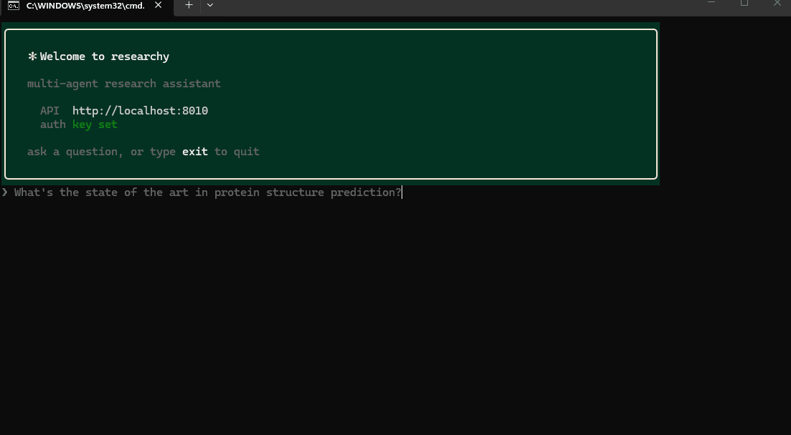

<div align="center">

# 🔬 Researchy

**A multi-agent research assistant that turns a question into a sourced report.**

Decompose → research in parallel → critique for gaps → synthesize. Orchestrated with
**LangGraph**, served over **FastAPI**, model-agnostic, durable, and streamed in real time.

<!-- badges -->
[](https://github.com/anuarkenzh1bekov/Researchy/actions/workflows/ci.yml)


[Quick start](#-quick-start) · [Features](#-key-features) · [Architecture](#-architecture) · [CLI](#-cli-client) · [Security](#-security)

</div>

---

Submit a research question and the system breaks it into self-contained sub-questions,
researches each one in parallel against web and academic sources, critiques the findings
for gaps and contradictions (looping back when the evidence is thin), then synthesizes a
structured Markdown report with globally numbered citations. Progress streams to the client
as it happens.

It's **backend only** — one backend, many frontends. A terminal CLI and an optional
Telegram bot ship in the repo; both are *just API consumers*, importing no server internals.

## 🎬 Demo

The CLI streaming a full run end to end — Planner → Researchers → Critic → Synthesizer —
in `--local` mode (no infra):



## ✨ Key features

**1. Multi-agent pipeline.** Planner → parallel Researchers → Critic → Synthesizer, wired
as a LangGraph `StateGraph`. The Critic can route gaps back to the Researchers for another
round before the report is written.

**2. Model-agnostic LLM layer.** LiteLLM behind a custom `LLMProvider` Protocol — cloud
(OpenAI / Anthropic / Gemini / Groq) and local (Ollama / vLLM / LM Studio) through one
interface. Agents never import a vendor SDK; swap models with one env var.

**3. Durable execution.** Celery (`task_acks_late`, retries) + LangGraph `PostgresSaver`
checkpointing means a crashed worker resumes from the last completed node instead of
restarting the whole run.

**4. Real-time progress.** Workers publish to Redis Pub/Sub; FastAPI relays it to clients
over SSE. You watch Planner → Researchers → Critic → Synthesizer advance live.

**5. Global citations.** Each Researcher's local `[n]` references are renumbered into one
report-wide scheme, so the inline `[n]` in the prose always match the final Sources list.

**6. Depth profiles.** One knob — `quick | standard | deep` — scales sub-question count,
sources per sub-question, and Critic→Researcher revision rounds together.

**7. Run it with zero infra.** A `--local` in-process mode runs the full pipeline with only
LLM + tool keys — no Postgres, Redis, or Celery — for quick trials and evaluation.

**8. Built-in evaluation.** An offline golden-set harness scores reports with an LLM-judge
on **faithfulness** (are claims grounded in cited sources?) and **coverage** (does it
answer the question?).

## 🧭 Architecture

```
Planner → [Researcher × N, parallel via Send] → Critic ─┬─ approved / maxed → Synthesizer → END
                                                        └─ gaps → Researcher retry → Critic
```

| Concern        | How it's done                                                                 |
| -------------- | ----------------------------------------------------------------------------- |
| **Orchestration** | LangGraph `StateGraph`; fan-out to Researchers via `Send`                   |
| **LLM access**    | LiteLLM behind an `LLMProvider` Protocol (cloud + local, one interface)     |
| **Durability**    | Celery `task_acks_late` + retries, LangGraph `PostgresSaver` checkpoints    |
| **Real-time**     | Redis Pub/Sub from workers → FastAPI SSE to clients                         |
| **Storage**       | PostgreSQL + pgvector (relational today, embeddings reserved)               |
| **Tools**         | `ResearchTool` Protocol → Tavily (web) + arXiv (academic)                   |

Two Postgres URLs on purpose: async (`asyncpg`) for the app, sync (`psycopg`) for
LangGraph's checkpointer — same database.

<details>
<summary><b>Module layout</b></summary>

```
research_assistant/
├── core/     # settings (pydantic-settings), exceptions, logging, crypto helpers
├── llm/      # LLMProvider Protocol, LiteLLM impl, provider factory/registry
├── storage/  # SQLModel models, async engine/session, repository layer
├── tools/    # ResearchTool Protocol + Tavily and Arxiv implementations
├── agents/   # Planner/Researcher/Critic/Synthesizer + graph state + StateGraph
├── events/   # Redis Pub/Sub publisher (agents) + subscriber (API SSE / bot)
├── tasks/    # Celery app + run_research_task (the only agents↔storage wiring)
├── api/      # FastAPI app: research CRUD + SSE + bot connect/disconnect/status
├── bot/      # dynamic per-token Telegram bot lifecycle + aiogram handlers
├── cli/      # terminal client (httpx + rich); also an in-process `--local` runner
├── eval/     # offline golden-set harness + LLM-judge (faithfulness/coverage)
└── scripts/  # CLI entrypoints (issue_api_key, smoke)
```

</details>

## 🚀 Quick start

> **Try it first with no infra.** If you only want to see the pipeline run, skip straight to
> [`--local` mode](#run-with-no-infra---local) — it needs only LLM + tool keys.

Full stack (durable tasks, SSE, persistence) needs three processes — Docker infra, the API,
and a Celery worker:

```bash
# 1. infra — Postgres + pgvector, Redis
docker compose up -d

# 2. deps  (Python 3.11 / 3.12)
pip install -e ".[dev]"

# 3. config — copy and fill in (cloud OR local model)
cp .env.example .env
#   cloud: LLM_MODEL=openai/gpt-4o     + OPENAI_API_KEY=...
#   local: LLM_MODEL=ollama/llama3.2   + LLM_API_BASE=http://localhost:11434

# 4. API
uvicorn research_assistant.api.app:app --reload

# 5. Celery worker  (separate terminal)
celery -A research_assistant.tasks.celery_app worker --loglevel=info
#   on Windows, add:  --pool=solo

# 6. issue an API key — no signup; identity comes from the key
python -m research_assistant.scripts.issue_api_key u1
#   → prints a raw key once; export it:  KEY=<the key>
#   (or set API_AUTH_ENABLED=false in .env to run open for quick curls)
```

Then drive it over HTTP:

```bash
# create a task — user_id is derived from the key, not the body
curl -X POST localhost:8000/research -H "Authorization: Bearer $KEY" \
  -H 'content-type: application/json' \
  -d '{"query":"impact of pgvector on RAG latency"}'

# stream progress — only the owner can read it (use the id from above)
curl -N -H "Authorization: Bearer $KEY" localhost:8000/research/<id>/stream

# connect a Telegram bot, bound to the authenticated user
curl -X POST localhost:8000/bot/connect -H "Authorization: Bearer $KEY" \
  -H 'content-type: application/json' -d '{"bot_token":"123:ABC"}'
```

## 💻 CLI client

The terminal client is *just another API consumer* (same role as the Telegram bot, no
server internals imported) — which is the point: one backend, many frontends.

```bash
research login --key $KEY          # save API url + key to ~/.researchy/config.json
research                           # interactive REPL
research ask "how does pgvector affect RAG latency?"   # one-shot, live-streamed
research history                   # your past tasks
research show <id>                 # a task's report
research bot connect <bot_token>   # attach a Telegram bot via the same API
```

`ask` / `repl` open the SSE stream, render Planner → Researchers → Critic → Synthesizer
progress live, then print the report as Markdown. In the REPL a follow-up line
(`and his trophies?`, `why?`) is folded into the previous question so the pipeline keeps
the subject; `new` clears the running topic. Config can also come from `RESEARCHY_API_URL` /
`RESEARCHY_API_KEY` (CI-friendly).

On Windows you can skip `pip install` and use the `research.cmd` wrapper in the repo root
(`research ask "..."`); it forwards to `python -m research_assistant.cli`.

### Run with no infra (`--local`)

Run the whole pipeline in-process with only LLM + tool keys — no Postgres / Redis / Celery:

```bash
research ask "how does pgvector affect RAG latency?" --local
research ask "compare Rust and Go for systems work" --local --depth deep
```

`--depth quick | standard | deep` (default `standard`) scales one knob across the whole run:
number of sub-questions, sources per sub-question, and Critic→Researcher revision rounds.

### Telegram bot — run one with zero infra

A standalone, single-tenant bot template lives in
[`templates/telegram-bot/`](templates/telegram-bot/): drop a token in its `.env`, run one
command, and it polls Telegram and runs the **full pipeline in-process** (the same `--local`
path) — no Docker, API, Celery, or API key.

```bash
cp templates/telegram-bot/.env.example templates/telegram-bot/.env   # add bot token + LLM + Tavily keys
python templates/telegram-bot/bot.py
```

That's the turnkey path. For the durable, multi-user path — many people attaching their own
bots through the API — use `/bot/connect` (see [Quick start](#-quick-start)) and the
`BotManager` in `bot/` instead.

## 🧪 Evaluation

An offline harness runs the pipeline over a fixed set of golden questions and scores each
report with an LLM-judge on **faithfulness** (are claims grounded in the cited sources?) and
**coverage** (does it answer the question?). It runs in-process — no infra — so it's a quick
quality gate:

```bash
python -m research_assistant.eval
```

Add cases in `research_assistant/eval/cases.py`.

## ⚡ Performance

Tool search results are cached per worker process with a short TTL
(`SEARCH_CACHE_TTL_SECONDS`, default 900; `0` disables), so the Critic→Researcher revision
loop and overlapping tasks don't re-hit Tavily / arXiv for the same query.

## 🔐 Security

Scoped deliberately for a portfolio backend — enough to show the pattern, not a full IAM:

- **Per-user API keys** (`Authorization: Bearer <key>`), stored as a SHA-256 hash only; the
  raw key is shown once at issue time.
- **No IDOR by construction** — `user_id` is never read from the request; it's derived from
  the key, and task reads 404 (not 403) for non-owners so ids don't leak.
- **Secrets at rest** — Telegram bot tokens are Fernet-encrypted in the DB.

Intentionally out of scope (documented seams, not built): user signup / passwords, JWT
issuance / rotation, RBAC, rate limiting, audit logging.

## 🗺️ Roadmap

Schema + module seams already accommodate these as one-module additions — see `# EXTENSION:`
comments in code; no schema migration required:

- Session memory / semantic recall (`ResearchTask.embedding` pgvector column)
- Custom user-defined agents (`LLMAgentConfig` schema sketch — flip `table=True` to enable)
- Confidence scoring on findings
- Threading depth profiles through the API / Celery path (currently `--local` only)

## 📄 License

Released under the [MIT License](https://opensource.org/licenses/MIT).
