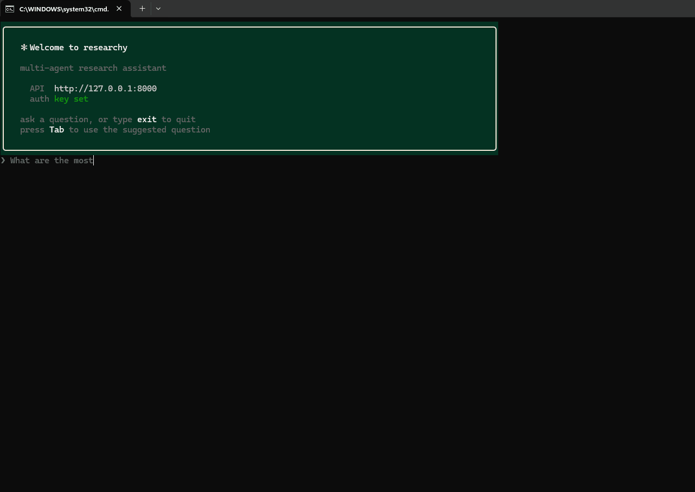

<div align="center">

# 🧐 Researchy

**A multi-agent research assistant that turns a question into a draft research paper.**

Decompose → research in parallel → critique for gaps → synthesize. Orchestrated with
**LangGraph**, served over **FastAPI**, model-agnostic, durable, and streamed in real time.

<!-- badges -->
[](https://github.com/anuarkenzh1bekov/Researchy/actions/workflows/ci.yml)


[Quick start](#-quick-start) · [Features](#-key-features) · [Architecture](#-architecture) · [CLI](#-cli-client) · [MCP server](#-mcp-server) · [Security](#-security)

</div>

---

Submit a research question and the system breaks it into self-contained sub-questions,
researches each one in parallel against web and academic sources, critiques the findings
for gaps and contradictions (looping back when the evidence is thin), then synthesizes a
**proposal-stage paper draft** in Markdown with globally numbered citations: an abstract,
introduction, a literature-review body, a *Proposed Methodology* (the study to run, written
as a proposal — no fabricated data), *Recommendations* (which surveys to administer, how to
extend the work), and a conclusion. Everything is grounded in the sources only; no primary
data is collected. Progress streams to the client as it happens.

It's **backend only** - one backend, many frontends. A terminal CLI, an optional
Telegram bot, and an MCP server ship in the repo; all three are *just API consumers*,
importing no server internals.

## 🎬 Demo



## ✨ Key features

**1. Multi-agent pipeline.** Planner → parallel Researchers → Critic → Synthesizer, wired
as a LangGraph `StateGraph`. The Critic can route gaps back to the Researchers for another
round before the report is written.

**2. Model-agnostic LLM layer.** LiteLLM behind a custom `LLMProvider` Protocol - cloud
(OpenAI / Anthropic / Gemini / Groq) and local (Ollama / vLLM / LM Studio) through one
interface. Agents never import a vendor SDK; swap models with one env var. Per-agent
overrides (`LLM_MODEL_PLANNER` / `_RESEARCHER` / `_CRITIC` / `_SYNTHESIZER`) route the
small structured-JSON calls (Planner, Critic) to a cheaper, faster model while the
Synthesizer keeps the strong one.

**3. Durable execution.** Celery (`task_acks_late`, retries) + LangGraph `PostgresSaver`
checkpointing means a crashed worker resumes from the last completed node instead of
restarting the whole run.

**4. Real-time progress.** Workers append to a per-task Redis Stream; FastAPI relays it to
clients over SSE. You watch Planner → Researchers → Critic → Synthesizer advance live, a
dropped client resumes exactly where it left off (`Last-Event-ID`), and a running task can
be cancelled mid-flight (`DELETE /research/{id}` / `research cancel`).

**5. Global citations.** Each Researcher's local `[n]` references are renumbered into one
report-wide scheme, so the inline `[n]` in the prose always match the final Sources list.

**6. Depth profiles.** One knob - `quick | standard | deep` - scales sub-question count,
sources per sub-question, and Critic→Researcher revision rounds together.

**7. Run it with zero infra.** A `--local` in-process mode runs the full pipeline with only
LLM + tool keys - no Postgres, Redis, or Celery - for quick trials and evaluation.

**8. Built-in evaluation.** An offline golden-set harness scores reports with an LLM-judge
on **faithfulness** (are claims grounded in cited sources?) and **coverage** (does it
answer the question?).

**9. Bring your own sources.** Attach up to 5 website URLs to a question - each is scraped
(httpx + trafilatura, depth-1 same-domain crawl, BM25 chunk ranking) and joins the tool
pool; every URL gets a user-visible `ok / partial / failed` outcome with a plain-English
reason. JS-heavy sites use an optional Playwright fallback
(`pip install -e ".[scraper]" && playwright install chromium`); without it they degrade
with `page requires JS rendering, browser unavailable`. Files work too: attach articles
via `--source-file` (CLI), `source_docs` (API), or the bot's "📚 Source material" button —
they join the same chunk index and are cited APA-style as uploaded documents.

**10. Build on your draft.** Upload a draft (txt/md/pdf/docx) and the pipeline treats it
as the paper's foundation: the Planner aims sub-questions at its gaps, the Synthesizer
preserves its structure and voice while integrating the cited findings.

**11. Interview intake.** Before researching a rough topic, an AI-generated interview
(`POST /research/clarify`) asks a few clarifying questions tailored to it — audience, scope,
angle — then gathers sources and depth; everything folds into one enriched query. On by
default in the CLI REPL, opt-in via `ask --interview`, and mirrored in the Telegram bot
(questions stored on the task row + a Skip button — no in-memory session).

## 🧭 Architecture

```
Planner → [Researcher × N, parallel via Send] → Critic ─┬─ approved / maxed → Synthesizer → END
                                                        └─ gaps → Researcher retry → Critic
```

| Concern        | How it's done                                                                 |
| -------------- | ----------------------------------------------------------------------------- |
| **Orchestration** | LangGraph `StateGraph`; fan-out to Researchers via `Send`                   |
| **LLM access**    | LiteLLM behind an `LLMProvider` Protocol (cloud + local, one interface)     |
| **Durability**    | Celery `task_acks_late` + retries, LangGraph `PostgresSaver` checkpoints    |
| **Real-time**     | Per-task Redis Stream from workers → FastAPI SSE (resumable via `Last-Event-ID`) |
| **Storage**       | PostgreSQL (tasks, reports, API keys; JSONB absorbs the flexible shapes)    |
| **Tools**         | `ResearchTool` Protocol → Tavily (web) + arXiv (academic)                   |

Two Postgres URLs on purpose: async (`asyncpg`) for the app, sync (`psycopg`) for
LangGraph's checkpointer - same database.

<details>
<summary><b>Module layout</b></summary>

```
research_assistant/
├── core/     # settings (pydantic-settings), exceptions, logging, crypto helpers
├── llm/      # LLMProvider Protocol, LiteLLM impl, provider factory/registry
├── storage/  # SQLModel models, async engine/session, repository layer
├── tools/    # ResearchTool Protocol + Tavily and Arxiv implementations
├── agents/   # Planner/Researcher/Critic/Synthesizer + graph state + StateGraph
├── events/   # Redis Streams publisher (agents) + reader (API SSE / bot)
├── tasks/    # Celery app + run_research_task (the only agents↔storage wiring)
├── api/      # FastAPI app: research CRUD + SSE + bot connect/disconnect/status
├── export/   # report files: md/docx/pdf renderer + LaTeX/APA paper emitter
├── bot/      # dynamic per-token Telegram bot lifecycle + aiogram handlers
├── cli/      # terminal client (httpx + rich); also an in-process `--local` runner
├── eval/     # offline golden-set harness + LLM-judge (faithfulness/coverage)
└── scripts/  # CLI entrypoints (issue_api_key, smoke)
```

</details>

## 🚀 Quick start

> **Try it first with no infra.** If you only want to see the pipeline run, skip straight to
> [`--local` mode](#run-with-no-infra---local) - it needs only LLM + tool keys.

Full stack (durable tasks, SSE, persistence) needs three processes - Docker infra, the API,
and a Celery worker:

> **Windows shortcut:** once deps and `.env` are in place (steps 2-3),
> `.\scripts\dev.ps1` does the rest in one go - infra, migrations, API and worker
> in their own windows. `.\scripts\dev.ps1 -Stop` tears it all down.

```bash
# 1. infra - Postgres, Redis
docker compose up -d

# 2. deps  (Python 3.11 / 3.12)
pip install -e ".[dev]"

# 3. config - copy and fill in (cloud OR local model)
cp .env.example .env
#   cloud: LLM_MODEL=openai/gpt-4o     + OPENAI_API_KEY=...
#   local: LLM_MODEL=ollama/llama3.2   + LLM_API_BASE=http://localhost:11434
#   web search: TAVILY_API_KEY=...     (Researchers need it for web sources)

# 4. schema - Alembic migrations own the schema
alembic upgrade head
#   (in APP_ENV=local the API also create_all's on startup, so this is optional
#    for a first run - but it's the real path and required outside local)

# 5. API
uvicorn research_assistant.api.app:app --reload

# 6. Celery worker  (separate terminal)
celery -A research_assistant.tasks.celery_app worker --loglevel=info
#   on Windows, add:  --pool=solo

# 7. issue an API key - no signup; identity comes from the key
python -m research_assistant.scripts.issue_api_key u1
#   → prints a raw key once; export it:  KEY=<the key>
#   (or set API_AUTH_ENABLED=false in .env to run open for quick curls)
```

Or skip the host setup entirely and run the whole stack in containers - one image
serves both roles (API and worker), and the API migrates the schema on boot:

```bash
docker compose --profile app up -d --build    # API on :8000 + worker + infra
docker compose exec api python -m research_assistant.scripts.issue_api_key u1
```

Then drive it over HTTP:

```bash
# create a task - user_id is derived from the key, not the body
curl -X POST localhost:8000/research -H "Authorization: Bearer $KEY" \
  -H 'content-type: application/json' \
  -d '{"query":"impact of pgvector on RAG latency"}'

# stream progress - only the owner can read it (use the id from above)
curl -N -H "Authorization: Bearer $KEY" localhost:8000/research/<id>/stream

# connect a Telegram bot, bound to the authenticated user
#   needs API_ENCRYPTION_KEY set in .env - the token is Fernet-encrypted at rest
#   generate one: python -c "from cryptography.fernet import Fernet; print(Fernet.generate_key().decode())"
curl -X POST localhost:8000/bot/connect -H "Authorization: Bearer $KEY" \
  -H 'content-type: application/json' -d '{"bot_token":"123:ABC"}'
```

## 💻 CLI client

The terminal client is *just another API consumer* (same role as the Telegram bot, no
server internals imported) - which is the point: one backend, many frontends.

```bash
research login --key $KEY          # save API url + key to ~/.researchy/config.json
research                           # interactive REPL
research ask "how does pgvector affect RAG latency?"   # one-shot, live-streamed
research ask "extend my survey" --draft draft.md --url https://site.test/docs  # your sources
research history                   # your past tasks
research show <id>                 # a task's report
research cancel <id>               # cancel a pending/running task
research bot connect <bot_token>   # attach a Telegram bot via the same API
```

`ask` / `repl` open the SSE stream, render Planner → Researchers → Critic → Synthesizer
progress live, then print the report as Markdown. Each run is also saved to
`exports/<query-slug>.md`; pass `--format docx` or `--format pdf` to save that instead
(`pip install "research-assistant[export]"` for the pure-pip `python-docx` / `fpdf2`
backends). For an academic-style write-up, `--format tex` emits a self-contained LaTeX
paper (title page, abstract, TOC, APA author-year citations via natbib/apalike, embedded
BibTeX — drop it straight into Overleaf), and `--format paper` compiles that to PDF with
the [tectonic](https://tectonic-typesetting.github.io) engine if it's on your PATH.
In the REPL a follow-up line
(`and his trophies?`, `why?`) is folded into the previous question so the pipeline keeps
the subject; `new` clears the running topic. The idle prompt cycles example questions as
ghost text — press **Tab** to fill the current suggestion into the line and edit it. Config
can also come from `RESEARCHY_API_URL` / `RESEARCHY_API_KEY` (CI-friendly).

**Interview intake.** For a rough topic, an interview step gathers context before the
pipeline runs: it asks the model (`POST /research/clarify`) for a few clarifying questions
tailored to the topic, collects your answers, then prompts for optional source URLs and
files and for the research depth (`quick / standard / deep`, Enter keeps the default) — all
folded into one enriched query (no schema change). It's **on by default in the REPL** for a
fresh topic (each question is skippable with Enter) and opt-in on the one-shot path via
`ask "..." --interview`; it stays off for pipes/CI (non-interactive stdout) and works the
same with `--local`. A failed clarify degrades to a plain ask.

`--url` (repeatable, max 5) adds your own websites as research sources and `--draft FILE`
(txt/md/pdf/docx) makes the paper build on your draft — both work with and without
`--local`. After the run a warnings block shows each site's outcome
(`✓ ok — 8 pages / ⚠ partial / ✗ failed — site returned 403 (access denied)`). The same
fields ride on `POST /research` (`urls`, `draft`), the per-URL outcomes in
`TaskView.scrape_report`, and `POST /research/draft-extract` converts an uploaded pdf/docx
to plain text for any client. `--source-file FILE` (repeatable, same formats) attaches an
article the paper should *cite* — vs `--draft`, which it *builds on* — and rides on
`POST /research` as `source_docs`. In Telegram, paste URLs inside the question text; a
document sent with the question as its caption asks "📝 My draft / 📚 Source material",
and extra documents sent while the task is still pending attach as sources automatically.
A fresh topic also triggers the **interview**: the bot replies with a few AI-generated
clarifying questions (stored on the task, so no in-memory session) and a Skip button — your
next message is folded into the query before the depth chooser, or Skip goes straight there.

On Windows you can skip `pip install` and use the `research.cmd` wrapper in the repo root
(`research ask "..."`); it forwards to `python -m research_assistant.cli`.

### Run with no infra (`--local`)

Run the whole pipeline in-process with only LLM + tool keys - no Postgres / Redis / Celery:

```bash
research ask "how does pgvector affect RAG latency?" --local
research ask "compare Rust and Go for systems work" --local --depth deep
```

Local runs render the **same live progress panel** as the API path — per-stage checklist, a
`2/4 · <sub-question>` researcher counter, elapsed time and a running token count — the
pipeline runs on a worker thread feeding the panel through a queue.

`--depth quick | standard | deep` (default `standard`) scales one knob across the whole run:
number of sub-questions, sources per sub-question, and Critic→Researcher revision rounds.
It works with and without `--local` — over the API it rides as `depth` on `POST /research`
(the same knob the Telegram bot's ⚡/🔍/🧠 buttons and the CLI interview's depth question
use).

### Telegram bot - run one with zero infra

A standalone, single-tenant bot template lives in
[`templates/telegram-bot/`](templates/telegram-bot/): drop a token in its `.env`, run one
command, and it polls Telegram and runs the **full pipeline in-process** (the same `--local`
path) - no Docker, API, Celery, or API key.

```bash
cp templates/telegram-bot/.env.example templates/telegram-bot/.env   # add bot token + LLM + Tavily keys
python templates/telegram-bot/bot.py
```

That's the turnkey path. For the durable, multi-user path - many people attaching their own
bots through the API - use `/bot/connect` (see [Quick start](#-quick-start)) and the
`BotManager` in `bot/` instead.

The API-connected bot sends the finished report as a `.md` attachment with **inline
[DOCX] / [PDF] buttons** - a tap re-renders that format on demand (needs the `export` extra
on the bot host). The same one renderer (`research_assistant/export/`) backs the CLI's
`--format` flag and the bot buttons.

## 🔌 MCP server

Researchy is also an MCP server — Claude Desktop or Claude Code can run
research as a tool. Like the CLI and the bot, it's *just an API consumer*
(`research-mcp`, stdio): 4 tools — `start_research`, `get_research`,
`list_research`, `cancel_research` — with async start + poll semantics, so
no tool call ever blocks on a multi-minute run.

Claude Code:

```bash
claude mcp add researchy -e RESEARCHY_API_KEY=<your-key> -- research-mcp
```

Claude Desktop (`claude_desktop_config.json`):

```json
{
  "mcpServers": {
    "researchy": {
      "command": "research-mcp",
      "env": {
        "RESEARCHY_API_URL": "http://127.0.0.1:8000",
        "RESEARCHY_API_KEY": "<your-key>"
      }
    }
  }
}
```

Requires the backend stack to be running, and `pip install -e ".[mcp]"`.

## 🧪 Evaluation

An offline harness runs the pipeline over a fixed set of golden questions and scores each
report with an LLM-judge on **faithfulness** (are claims grounded in the cited sources?) and
**coverage** (does it answer the question?). It runs in-process - no infra - so it's a quick
quality gate:

```bash
python -m research_assistant.eval
```

Add cases in `research_assistant/eval/cases.py`.

## ✅ CI

Four jobs on every push: **lint + types + unit suite** (ruff, mypy, and a
service-free pytest run - all LLM/tools/DB/Redis are fakes, so it finishes in
seconds), **migrations** (every Alembic migration up against a real pgvector
database, a repository round-trip, then every downgrade back to zero), **e2e**
(real Postgres + Redis + the actual Celery task body - LangGraph checkpointer,
event bus, SSE replay - with only the LLM and search tools faked), and a
**Docker image build** (the deploy artifact must always build).

## ⚡ Performance

Tool search results are cached per worker process with a short TTL
(`SEARCH_CACHE_TTL_SECONDS`, default 900; `0` disables), so the Critic→Researcher revision
loop and overlapping tasks don't re-hit Tavily / arXiv for the same query.

## 🔐 Security

Scoped deliberately for a portfolio backend - enough to show the pattern, not a full IAM:

- **Per-user API keys** (`Authorization: Bearer <key>`), stored as a SHA-256 hash only; the
  raw key is shown once at issue time. Keys record `last_used_at` on every authenticated
  request and can be revoked (`issue_api_key --list <user>` / `--revoke <key_id>`); a
  revoked key gets the same 401 as an unknown one.
- **No IDOR by construction** - `user_id` is never read from the request; it's derived from
  the key, and task reads 404 (not 403) for non-owners so ids don't leak.
- **Secrets at rest** - Telegram bot tokens are Fernet-encrypted in the DB.

Intentionally out of scope (documented seams, not built): user signup / passwords, JWT
issuance / rotation, RBAC, rate limiting, audit logging.

## 🩺 Operations

The system is four moving parts (API, Celery worker, Redis, Postgres), so "is it up?" has
four answers. Two unauthenticated endpoints cover them:

- **`GET /health`** - pings Postgres (`SELECT 1`), Redis (`PING`) **and the Celery worker**
  (broker round-trip): `200 {"status": "ok"}` when all three respond, `503` with the failing
  check's reason otherwise. An alive API process alone proves nothing when the worker is
  dead and every task would sit `pending` forever.
- **`GET /metrics`** - Prometheus text format, aggregated from the DB at scrape time: task
  counts by status, create-to-done duration sum/count, total LLM tokens consumed.
- **Pending timeout** - a task not picked up within `TASK_PENDING_TIMEOUT_SECONDS`
  (default 300; `0` disables) flips to `failed` on read with a plain-English reason, and its
  SSE stream emits a terminal event instead of waiting forever.

Intentionally out of scope: full OpenTelemetry tracing (the per-task event stream already
carries timestamps per pipeline stage - a documented seam, not built).

## 🗺️ Roadmap

Schema + module seams already accommodate these as one-module additions - see `# EXTENSION:`
comments in code; no schema migration required:

- Custom user-defined agents (`LLMAgentConfig` schema sketch - flip `table=True` to enable)
- Confidence scoring on findings

## 🤖 Build prompt

The full spec this project was built from lives at
[`docs/claude_code_prompt.md`](docs/claude_code_prompt.md) - a single self-contained prompt
that hands Claude Code (or a similar agent) everything it needs to reconstruct the backend
from an empty directory: hard requirements, architecture, tech stack, and the layer-by-layer
build order. Drop it into an empty repo to regenerate the project, or use it as a template
for briefing agents on your own builds.

## 📄 License

Released under the [MIT License](https://opensource.org/licenses/MIT).
